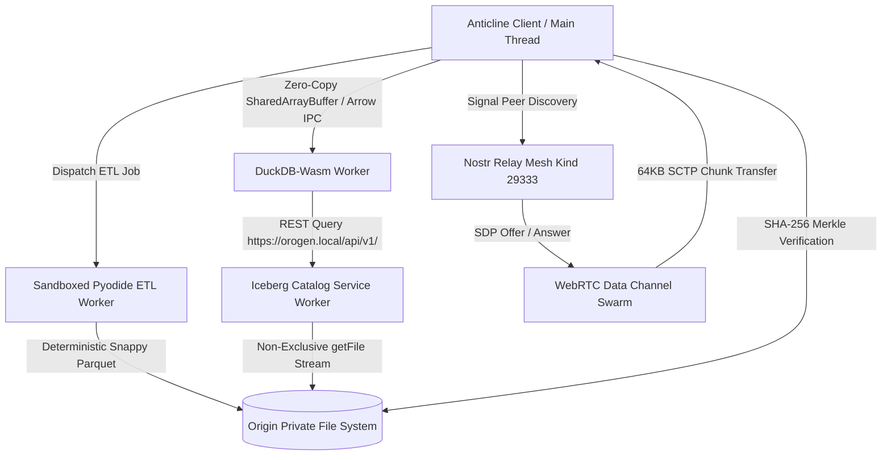

# Orogen Architecture Specification

Orogen is a decentralized, browser-based quantitative data lakehouse protocol engineered for browser environments supporting WebAssembly, Origin Private File System (OPFS), and WebRTC.

## 1. System Architecture Overview

## 2. WebWorker Inter-Process Communication (IPC)

To prevent main-thread latency spikes during high-frequency tick calculations or large OLAP scans:
1. **Zero-Copy Arrow Vectors:** DuckDB query results are transmitted as Arrow IPC record batches or transferred `ArrayBuffer` payloads.
2. **Dedicated Threads:**
   - `duckdb.worker.ts`: Executes analytical queries, table creation, and temporal ASOF JOINs.
   - `pyodide.worker.ts`: Executes crowd-sourced Python ETL transformations in isolation.

## 3. Storage Hierarchy & OPFS Concurrency Engine

Browsers impose distinct locking mechanics on the Origin Private File System (OPFS):
- `createSyncAccessHandle()` requires exclusive access and is utilized **strictly during atomic write phases** (when persisting verified Parquet chunks downloaded from the P2P swarm or flushed from the hot buffer).
- All query scans (DuckDB and Iceberg Service Worker catalog interceptions) strictly utilize asynchronous, non-exclusive `getFile()` streams. This guarantees multiple workers can perform concurrent scans without encountering `AccessError` locks.

### LRU Eviction Subsystem
Storage quotas are actively tracked via `navigator.storage.estimate()`:
- High-water mark: **85% of allowed storage quota**.
- When exceeded, the engine iterates partition metadata, evicting the least-recently accessed Parquet chunks and notifying the client UI to mark corresponding ranges as `Data Offloaded`. Offloaded partitions are re-fetched on-demand via the P2P swarm.

## 4. Sandboxed Pyodide ETL Execution

1. **JS Binding Annihilation:** Immediately following Pyodide WASM runtime boot, all bindings to the JavaScript host environment (`js` module, `window`, `document`, and worker scope access) are purged from Python's `sys.modules` and globals.
2. **Network Allowlist:** External data ingestion is restricted to an injected, verified Python callable `fetch_data(url)`. This function audits the target URL against the dataset manifest's `etl.source_api` origin before issuing the HTTP request.
3. **Deterministic Parquet Output:** To ensure SHA-256 Merkle roots match across independent analytical nodes:
   - Dynamic metadata timestamps are pinned to Unix epoch `1970-01-01T00:00:00Z`.
   - Parquet serialization enforces uniform dictionary encoding, record batch sizing, and Snappy compression.

## 5. P2P Mesh, SCTP Backpressure & The Strike System

- **Nostr Signaling:** Peer discovery and SDP negotiation leverage ephemeral Nostr events (Kind 29333) broadcast over public relays (`wss://relay.damus.io`, `wss://nos.lol`).
- **SCTP Flow Control:** Parquet payloads are sliced into 64KB chunks. Senders monitor `dataChannel.bufferedAmount`. If buffers exceed 1MB, transmissions pause until the `bufferedamountlow` event fires (threshold set to 65,536 bytes).
- **Strike System & Malicious Node Quarantine:** Each downloaded chunk is hashed via Web Crypto SHA-256 and matched against the Merkle tree leaf. Any mismatch immediately:
  1. Closes the `RTCPeerConnection`.
  2. Permanently flags the peer's Nostr public key as `banned: true` in IndexedDB.
  3. Re-routes chunk requests to the next available swarm peer.
