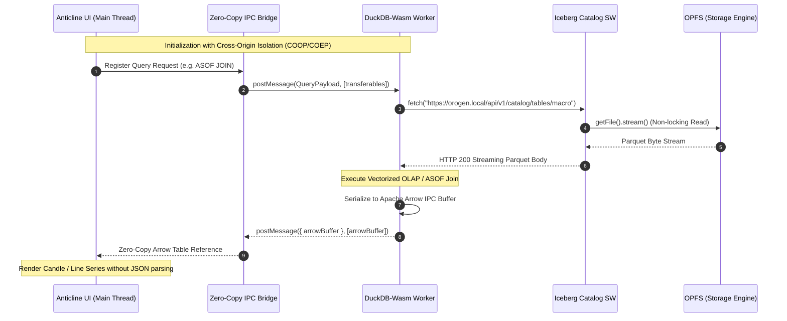

# Orogen (The Protocol)

[](https://github.com/FranekJemiolo/orogen/actions/workflows/ci.yml)
[](LICENSE)
[](package.json)

> **Decentralized, browser-based quant data lakehouse protocol.**

Orogen turns the browser into a high-performance, verifiable OLAP data warehouse powered by DuckDB-Wasm, sandboxed Pyodide ETL, Origin Private File System (OPFS), and Nostr-signaled WebRTC P2P chunk swarming.

---

## Zero-Copy WebWorker ↔ Main Thread Handoff

The following sequence diagram maps the zero-copy Arrow IPC / `SharedArrayBuffer` memory handoff between the Anticline main UI thread, DuckDB-Wasm worker, and the Service Worker catalog interceptor:



---

## Key Features

1. **In-Browser OLAP with DuckDB-Wasm:** Fast vectorized queries and multi-dataset `ASOF JOIN` execution directly on Parquet files in the browser.
2. **Deterministic Pyodide ETL Engine:** Crowdsourced Python data transformers isolated from the host environment, producing bit-exact Parquet partitions for Merkle tree validation.
3. **OPFS Storage Management:** Non-locking concurrent reads via `getFile()` and quota-aware LRU eviction at >85% capacity.
4. **P2P Swarm Distribution:** Nostr signaling (Kind 29333 ephemeral events) over WebRTC with 64KB SCTP backpressure control.
5. **Byzantine Fault Tolerance:** Cryptographic strike system banning malicious peers attempting to poison analytical datasets.
6. **Virtual Iceberg Catalog:** Service Worker intercepting DuckDB REST requests to stream local OPFS Parquet files transparently.

---

## Directory Structure

```
orogen/
├── .github/workflows/       # CI validation & GitHub Pages docs deployment
├── docs/                    # Architectural specs and documentation
├── schemas/
│   ├── dataset.schema.json  # JSON schema for dataset manifests
│   └── examples/            # Example dataset manifests
├── src/
│   ├── catalog/             # Iceberg REST Service Worker interceptor
│   ├── engine/              # DuckDB & Pyodide worker runtimes
│   ├── network/             # Nostr signaling & WebRTC data channel manager
│   ├── security/            # Merkle tree & strike system
│   ├── storage/             # OPFS driver with LRU eviction
│   └── types/               # Strict TypeScript definitions
└── tests/                   # Vitest unit test suites
```

---

## Getting Started

```bash
# Install dependencies
npm install

# Run typecheck
npm run lint

# Run unit tests
npm test

# Build the protocol package
npm run build
```

## License

Licensed under the [Apache License, Version 2.0](LICENSE).
